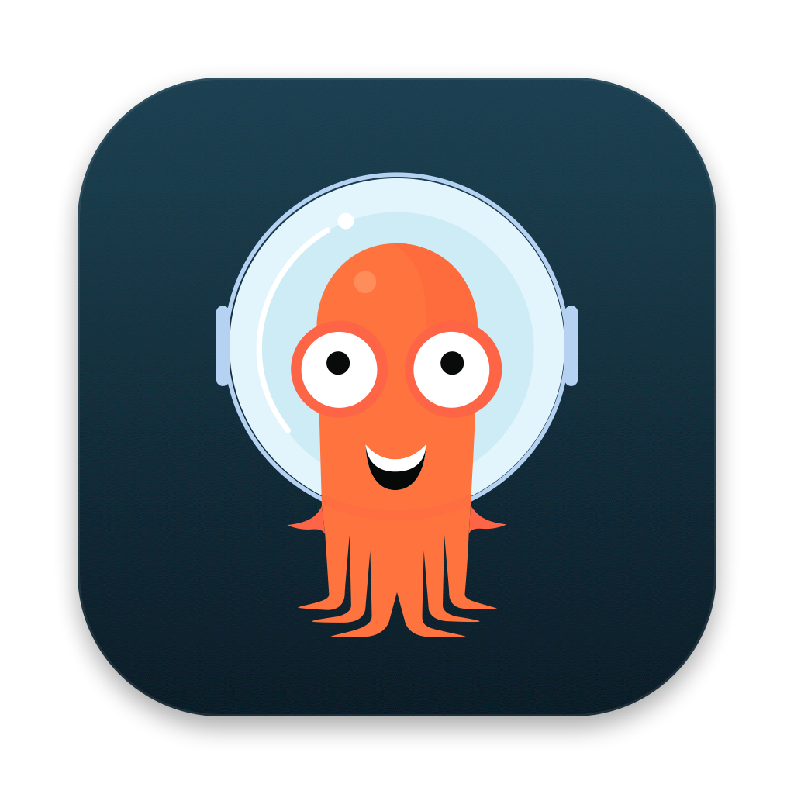

<p align="center"></p>

# Syncscope for Argo Apps

**A fast, cross-platform desktop app for the Argo tools, starting with Argo CD** — every instance and cluster in one
place, instant search over thousands of applications, and failures explained instead of
hidden. Built with Go + Wails + React.

Syncscope aims to cover everything the Argo CD web UI does, plus what it lacks when you
run ApplicationSets at scale: multi-instance view, problem grouping, bulk operations and
an offline cache.

Supports **Argo CD**, **Argo Workflows**, **Argo Rollouts** and **Argo Events**.

📖 **[User guide with screenshots](docs/USER_GUIDE.md)**

<p align="center"></p>

> Syncscope is an independent project. It is **not affiliated with or endorsed by** the
> Argo project or the CNCF. Argo and Argo CD are trademarks of The Linux Foundation.

## Features

### One window for the Argo tools
- **Argo CD** — every instance side by side (API server, or `--core` mode straight through Kubernetes).
- **Argo Workflows** — workflows (DAG / steps graph, step logs, inputs/outputs), WorkflowTemplates
  (submit with parameters), CronWorkflows (run now, suspend/resume); stop, terminate, suspend,
  resume, resubmit, delete.
- **Argo Rollouts** — canary / blue-green status (step, weight, replicas, stable vs canary),
  steps timeline, promote, promote-full, pause, abort, retry, restart; link to the owning Argo CD app.
- **Argo Events** — event flow graph (EventSources → Sensors → Triggers), EventSources, Sensors,
  EventBus, conditions, pods and logs, restart.
- Workflows, Rollouts and Events (and core mode) are read from **Kubernetes via your kubeconfig**,
  like Lens: pick the contexts in *Settings → Kubernetes clusters* (exec auth plugins such as
  `gke-gcloud-auth-plugin` work; nothing is contacted until you enable it).

### Built for scale
- Live updates (Argo CD watch stream, Kubernetes watches) — no polling.
- **Instant search** over tens of thousands of apps (virtualized lists), per-tab queries,
  query language below, **saved searches** and **favorites** (★, `is:favorite`).
- **On-disk cache**: the last known state of every instance shows immediately on launch,
  even offline, while the live data refreshes in the background.
- **⌘P command palette**: jump to any app, ApplicationSet, workflow, rollout or event source,
  recent items and favorites first, plus app-wide commands.

### Failures explained
- Every object carries a list of problems saying *what* failed and *why*: failed sync and each
  failed resource/hook, `*Error` conditions, sync retries, Degraded resources with the pod reason
  (CrashLoopBackOff, ImagePullBackOff…), unreachable clusters, ApplicationSet generation errors,
  failed workflow steps with their message, aborted rollouts, unhealthy event sources and sensors.
- **Problems** tab groups identical failures across apps ("group by cause").
- **Desktop notifications** when something starts failing (and optionally recovers), batched;
  click to open it.

### Argo CD operations
- Application page like Argo CD: **Tree** (resource graph, failing path in red, zoom, filter),
  Summary, Resources, **Diff** (live vs desired), **Events**, **Parameters**, **Manifest** (YAML),
  **History & rollback** (commit message, author, date).
- Per resource: details, **logs** (pod or whole workload, follow, previous, filter), **terminal**
  (Argo CD web terminal), live manifest view/edit, diff, events, every resource action, delete,
  sync only this resource.
- **Bulk actions** with per-app results: sync (prune / dry-run / force / out-of-sync only),
  selected-resources sync, refresh, hard refresh, restart, terminate, sync policy, delete.
- **Create applications**, edit Helm values / parameters / Kustomize images / target revision,
  sync policy (auto-sync, prune, self-heal), **sync windows**, **Argo CD Image Updater** annotations.
  Edits on ApplicationSet-generated apps warn when the ApplicationSet will revert them.
- **ApplicationSet page**: generated apps, generators, spec, conditions, bulk actions, delete.
- **Argo CD configuration** in Settings: connect/remove repositories, create/edit/delete projects,
  rename/remove clusters, generate/revoke account tokens.

### Desktop niceties
- Collapsible / resizable sidebar (⌘B), list or tiles, light and dark themes, Argo CD look & feel.
- Daily update check against GitHub Releases (opt-out in Settings).

### Query language
| Query | Meaning |
|---|---|
| `payments api` | free text over name, appset, project, cluster, namespace, repo, path, labels (AND) |
| `"exact phrase"`, `-legacy` | phrase / negation (works on every term) |
| `appset:"x"` (quoted = exact) `project:x` `cluster:x` `ns:x` `repo:x` `rev:main` `ctx:prod` `name:x` | field filters |
| `health:degraded` `sync:outofsync` `label:team=core` | status / labels |
| `is:error` `is:warning` `is:problem` `is:running` `is:auto` `is:manual` `is:deleting` `is:favorite` | computed state |
| Workflows / Rollouts / Events: `phase:failed` `template:x` `cron:x` `app:x` `ns:x` `cluster:x` `is:error` | |

Shortcuts: `⌘P` palette · `⌘K` or `/` search · `⌘B` sidebar · `↑/↓` `j/k` move · `Enter` open ·
`Space` select · `⌘A` select all · `Esc` back.

## Authentication

Every method `argocd login` supports against an API server:

| Method | Notes |
|---|---|
| SSO | OIDC authorization code + PKCE with a local callback on `localhost:8085` (same as `argocd login --sso`). Works with the bundled Dex and external OIDC providers (`oidc.config`, honors `cliClientID`). Refresh tokens renew the session automatically. |
| Username / password | Local accounts. Optionally remembers the password to re-login on expiry. |
| API token | Account or project role tokens. |
| Import from argocd CLI | Reads `~/.config/argocd/config` (or `$ARGOCD_CONFIG_DIR`), including tokens, refresh tokens, `insecure`, `plain-text`, `grpc-web-root-path` and client certificates. |

Also supported: `--insecure`, custom CA, mTLS client certificates, extra
headers (Cloudflare Access, IAP…), root paths (`https://host/argocd`), HTTP(S)
proxies from the environment.

Secrets are stored in the OS keychain (macOS Keychain, Windows Credential
Manager, Secret Service on Linux), falling back to a `0600` file if no
keychain is available. Config lives in the user config dir (`syncscope/`).

**Core mode** (`argocd --core` equivalent) needs no Argo CD API server: pick a kubeconfig
context and the Argo CD namespace; Applications and ApplicationSets are read and synced through
Kubernetes. Resource tree, diff, rollback, resource actions and configuration need an API server.

## Development

Requirements: Go 1.25+, Node 20+, Wails CLI (`go install github.com/wailsapp/wails/v2/cmd/wails@latest`).

```bash
wails dev          # hot reload
wails build        # build/bin/Syncscope.app (or .exe / Linux binary)
```

### Mock Argo CD

`cmd/mockargo` is a fake Argo CD API (apps generated by ApplicationSets, live
stream, actions, local login `admin`/`admin`, and a fake Dex for the SSO flow)
with realistic failures:

```bash
go run ./cmd/mockargo -port 8099 -apps 15000 -name prod
go run ./cmd/mockargo -port 8098 -apps 4000 -name staging

# isolated config, no keychain
SYNCSCOPE_CONFIG_DIR=/tmp/syncscope-dev SYNCSCOPE_NO_KEYRING=1 wails dev
```

### Tests

```bash
go test ./...                                                     # unit tests
MOCKARGO_URL=http://localhost:8099 go test ./internal/store -run Integration -race -v
```

## Layout

```
main.go, app.go            Wails entry point and bindings
internal/argocd            Argo CD REST client, SSO (OIDC/PKCE), terminal, generated API interface
internal/core              argocd.API over Kubernetes (core mode)
internal/store             Argo CD instances: live cache, problems, bulk actions, disk cache
internal/kube              kubeconfig contexts, client-go mirrors, pods, logs, events
internal/kubestore         Workflows / Rollouts / Events summaries, problems and actions
internal/notify            batched desktop notifications
internal/updater           GitHub Releases update check
frontend/src               React UI (data.ts / kdata.ts stores, search.ts query language)
cmd/mockargo, cmd/mockkube fake Argo CD and Kubernetes API servers for development and tests
scripts/                   dev.sh, e2e suite (kind + real Argo CD), API generator
```

## Roadmap

Done: the whole original roadmap (Argo CD parity items, Workflows, Rollouts, Events, core mode,
notifications, palette, cache, CI/release pipeline). Next ideas:

- Open a pull request instead of editing the app spec (GitHub / GitLab).
- Argo Workflows: retry (needs argo-server), artifacts download, archived workflows.
- Argo Rollouts: AnalysisRuns / Experiments details, rollout history.
- Argo Events: live event stream per EventSource.
- Signed and notarized macOS builds published from CI (needs an Apple Developer ID).

## Install

Download the latest build from the GitHub **Releases** page and verify it
against `SHA256SUMS` (`shasum -a 256 -c SHA256SUMS --ignore-missing`):

- **macOS** (Apple Silicon): `Syncscope_<version>_darwin_arm64.zip`
  — unzip and move `Syncscope.app` to `/Applications`. Release builds are
  signed and notarized when signing is configured; for an unsigned build,
  right-click → *Open* the first time.
- **Windows**: `Syncscope_<version>_windows_amd64_installer.exe`, or the
  portable `.zip`. Requires the WebView2 runtime (preinstalled on Windows 11;
  the installer fetches it if missing).
- **Linux** (x86-64 or ARM64): `Syncscope_<version>_linux_amd64.tar.gz` or
  `Syncscope_<version>_linux_arm64.tar.gz`. Needs GTK 3 and
  WebKitGTK 4.1 (`sudo apt install libgtk-3-0 libwebkit2gtk-4.1-0`).

Or build from source (see Development).

## Development and testing

`scripts/dev.sh` starts two mock Argo CD instances (`:8099`, `:8098`) and
`wails dev` with an isolated config and no keychain. Frontend unit tests use
Vitest (`cd frontend && npm test`). An end-to-end suite (`scripts/e2e`) runs
the API client against a real Argo CD in kind.

CI (`.github/workflows/ci.yml`) runs on every push and PR: `go vet`, unit
tests, integration tests against `cmd/mockargo`, `tsc` + Vitest, and a Wails
build on macOS, Windows and Linux. `e2e.yml` runs weekly and on demand.

See [CONTRIBUTING.md](CONTRIBUTING.md) for setup, commands and conventions.

## Releasing

Push a `v*` tag (e.g. `git tag -a v0.2.0 -m v0.2.0 && git push origin v0.2.0`).
`.github/workflows/release.yml` builds macOS (Apple Silicon), Windows amd64 (NSIS
installer) and Linux (amd64 and arm64, on native runners), optionally signs and notarizes the macOS app, writes
`SHA256SUMS` and publishes a GitHub Release. Details and the required signing
secrets: [docs/RELEASING.md](docs/RELEASING.md).

## License

[Apache License 2.0](LICENSE). See [NOTICE](NOTICE).
