# Syncscope user guide

Syncscope is a desktop app for the Argo tools: **Argo CD**, **Argo Workflows**, **Argo Rollouts**
and **Argo Events**, for every instance and cluster in one window. This guide walks through the
app screen by screen.

> The screenshots use demo data (a fake Argo CD and Kubernetes, see
> [Regenerating the screenshots](#regenerating-the-screenshots)).

**Contents**

1. [Install and first launch](#1-install-and-first-launch)
2. [Connect to Argo CD](#2-connect-to-argo-cd)
3. [The main window](#3-the-main-window)
4. [Find applications](#4-find-applications)
5. [See what is failing and why](#5-see-what-is-failing-and-why)
6. [ApplicationSets](#6-applicationsets)
7. [The application page](#7-the-application-page)
8. [Act on many apps at once](#8-act-on-many-apps-at-once)
9. [Kubernetes clusters (Workflows, Rollouts, Events)](#9-kubernetes-clusters)
10. [Argo Workflows](#10-argo-workflows)
11. [Argo Rollouts](#11-argo-rollouts)
12. [Argo Events](#12-argo-events)
13. [Command palette and shortcuts](#13-command-palette-and-shortcuts)
14. [Manage the Argo CD configuration](#14-manage-the-argo-cd-configuration)
15. [Notifications, cache and updates](#15-notifications-cache-and-updates)
16. [Troubleshooting](#16-troubleshooting)

---

## 1. Install and first launch

Download the build for your system from the releases page (or build it, see the
[README](../README.md#development)) and open **Syncscope**.

- **macOS**: if the build is not signed, macOS may refuse to open it the first time. Right-click
  the app → **Open**, or allow it in *System Settings → Privacy & Security*.
- **Keychain**: Syncscope stores tokens in the system keychain. When macOS asks, choose
  **Always Allow**.

On first launch the window is empty: open **Settings** (⚙ at the bottom of the sidebar) to add
your first Argo CD instance.

## 2. Connect to Argo CD

**Settings → Argo CD instances** lists every instance you manage.

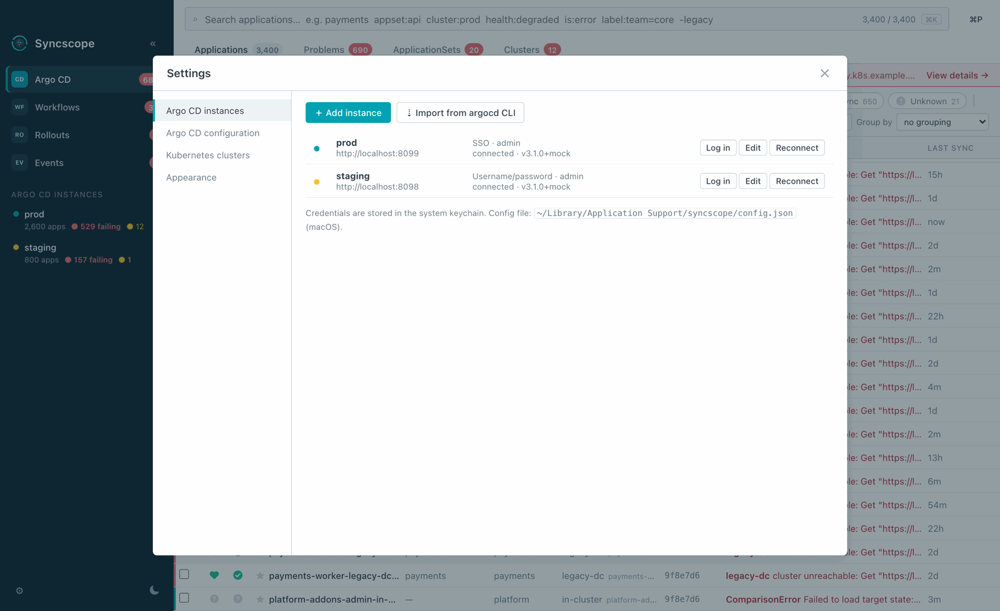

- **Import from argocd CLI** reuses the servers and sessions you already have in
  `~/.config/argocd/config`: the quickest way to start.
- **Add instance** opens the form below.

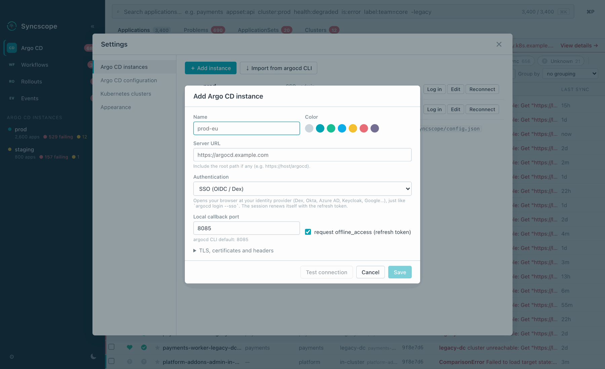

| Authentication | When to use it |
|---|---|
| **SSO (OIDC / Dex)** | Your company login (Okta, Azure AD, Google, Keycloak, Dex…). A browser tab opens, you log in, and Syncscope keeps the session alive with the refresh token. Same as `argocd login --sso`. |
| **Username and password** | Local Argo CD accounts such as `admin`. You can let Syncscope remember the password to renew the session. |
| **API token** | A token from `argocd account generate-token` or a project role. |
| **Imported from argocd CLI** | Uses the token saved by the CLI. |
| **Core mode** | No Argo CD API server: Applications are read and synced directly through Kubernetes with your kubeconfig (like `argocd --core`). Resource tree, diff and rollback need an API server. |

**TLS, certificates and headers** covers self-signed servers (`--insecure`), a custom CA,
client certificates (mTLS) and extra headers for proxies such as Cloudflare Access.

Use **Test connection** before saving: it shows the Argo CD version and the SSO provider.

## 3. The main window

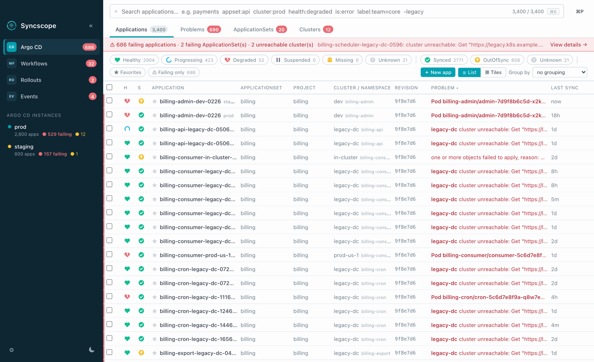

- **Sidebar, top**: the products, **Argo CD · Workflows · Rollouts · Events**, each with the number
  of failing items in red.
- **Sidebar, below**: your Argo CD instances (or Kubernetes clusters, for the other products),
  with the number of apps and how many are failing. Click one to show only it; ⌘-click to pick
  several; **all** shows everything again.
- **Sidebar, bottom**: ⚙ Settings and the light/dark theme switch. **«** collapses the sidebar
  (⌘B); drag its right edge to resize it.
- **Red banner**: how many apps are failing right now. Click it to see why.
- **Tabs**: Applications, Problems, ApplicationSets and Clusters. Each tab has its own search.
- **Status chips**: filter by health (Healthy, Degraded…) and sync status (Synced, OutOfSync…).
  The small numbers are counts.

Everything updates live: changes in Argo CD appear within a second, without refreshing.

## 4. Find applications

Type in the search box (⌘K or `/` focuses it). Results appear as you type, even with thousands of
apps.

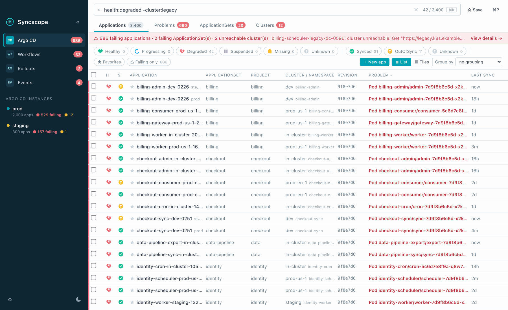

| You type | You get |
|---|---|
| `payments api` | apps whose name, ApplicationSet, project, cluster, namespace, repo or labels contain both words |
| `"payments-api"` | the exact phrase |
| `-legacy` | everything **without** "legacy" |
| `appset:"checkout"` | apps of the ApplicationSet `checkout` (quotes = exact match) |
| `project:x` `cluster:x` `ns:x` `repo:x` `rev:main` `ctx:prod` | filter by field |
| `health:degraded` `sync:outofsync` | by status |
| `label:team=core` | by label |
| `is:error` `is:warning` `is:running` `is:auto` `is:manual` `is:favorite` | by state |

Tips:

- Click an **ApplicationSet**, project or cluster in a row to add it to the search.
- **☆ Save** keeps the current search; **Saved ▾** brings it back later.
- Click the **★** next to an app name to make it a favorite; the **★ Favorites** chip shows only those.
- **Tiles** shows apps as cards, like the Argo CD home page. **List** goes back to the table.
- **Group by** groups the list by ApplicationSet, cluster, project or instance. Each group has
  its own checkbox to select all its apps.

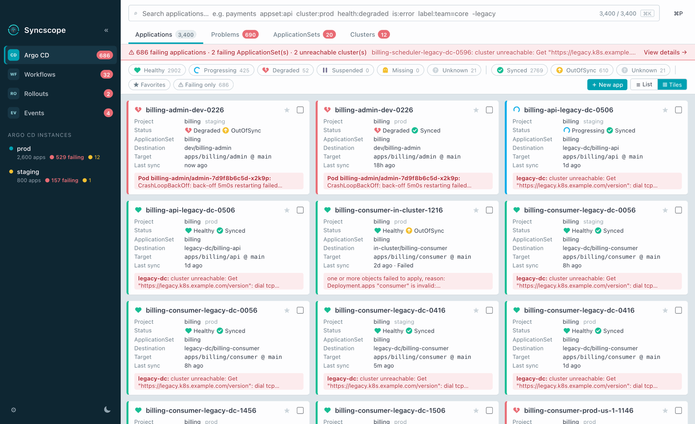

## 5. See what is failing and why

The **Problems** tab answers "what is broken and why" for every app at once.

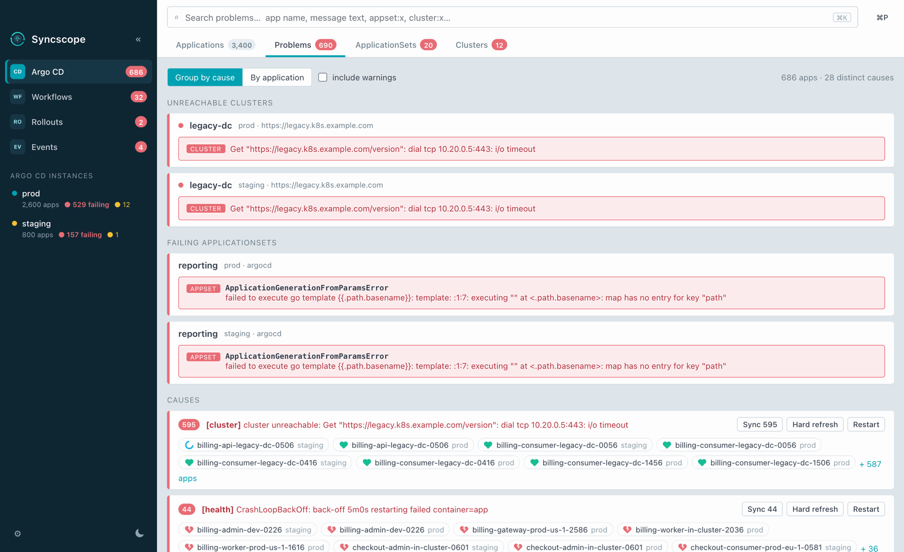

- **Group by cause** puts together apps that fail for the same reason, so 600 broken apps can
  turn out to be 3 problems (for example, one unreachable cluster). Each cause has buttons to
  sync, hard refresh or restart all its apps.
- **By application** lists each failing app with all its reasons.
- Unreachable clusters and failing ApplicationSets are shown at the top.

The reasons are written in plain words: the resource that failed to sync and the error message,
the pod reason (`CrashLoopBackOff`, `ImagePullBackOff`…), `ComparisonError` from Argo CD, retries,
unreachable clusters.

## 6. ApplicationSets

The **ApplicationSets** tab lists every ApplicationSet with how many apps it generated, their
health, how many are failing and the ApplicationSet's own error (for example a template error).

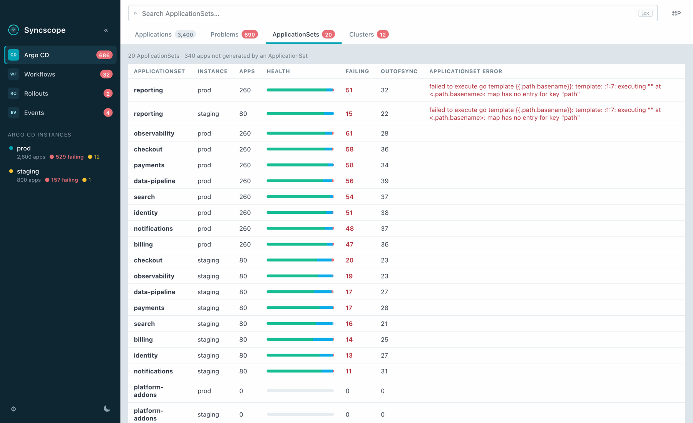

Click one to open its page: generated apps, generators, spec and conditions, plus buttons to sync,
refresh or restart **all** its apps, and to delete the ApplicationSet. Deleting warns you that the
generated apps go with it.

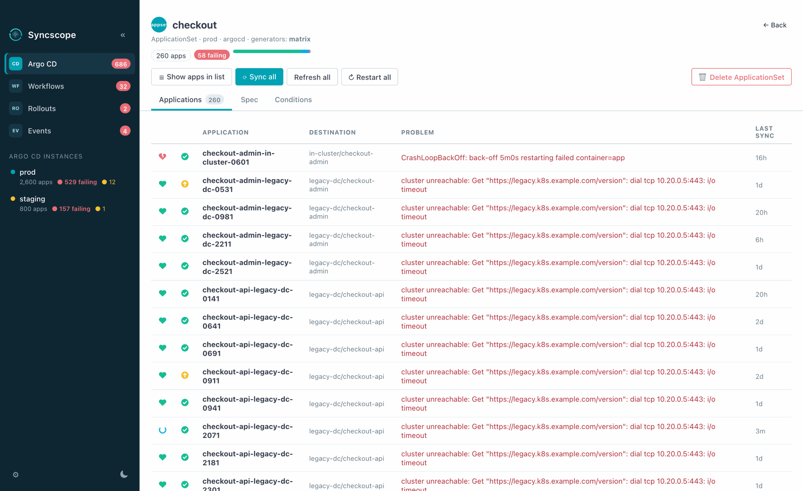

## 7. The application page

Click an app to open it. The header shows its health, sync status, sync policy and actions
(Sync, Refresh, Hard refresh, Restart, Delete, Open in Argo CD). **Why it is failing** stays
at the top while you look around; click **hide** to collapse it.

### Tree

The resources of the app, like in Argo CD. The path to a broken resource is drawn in **red**, so
you can follow it from the app down to the failing pod.

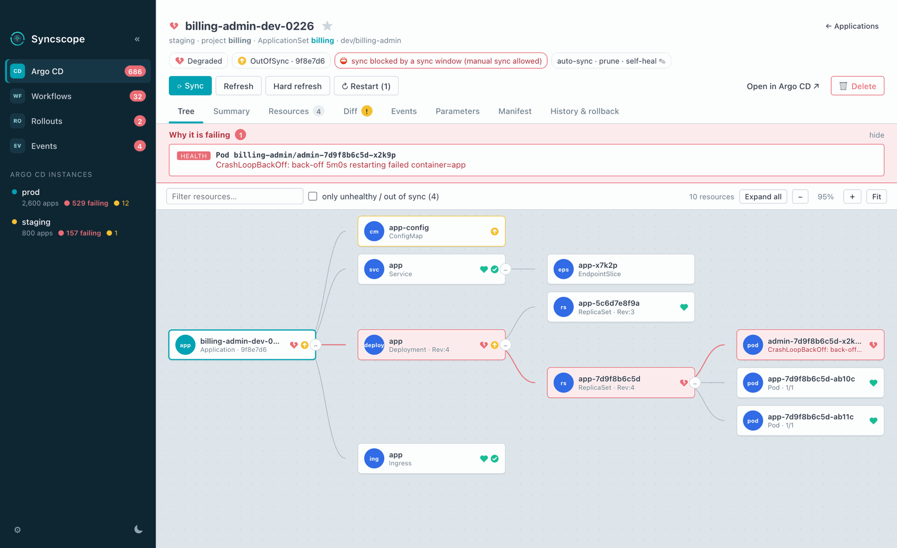

- Click a resource to open its panel on the right.
- Double-click a pod or a workload to open its **logs** directly.
- **only unhealthy / out of sync** hides everything else; **Fit** zooms to fit; ⌘ + scroll zooms.
- The `–`/`+N` buttons on a node collapse or expand its children.

### Resource panel: logs, terminal, manifest, diff, events

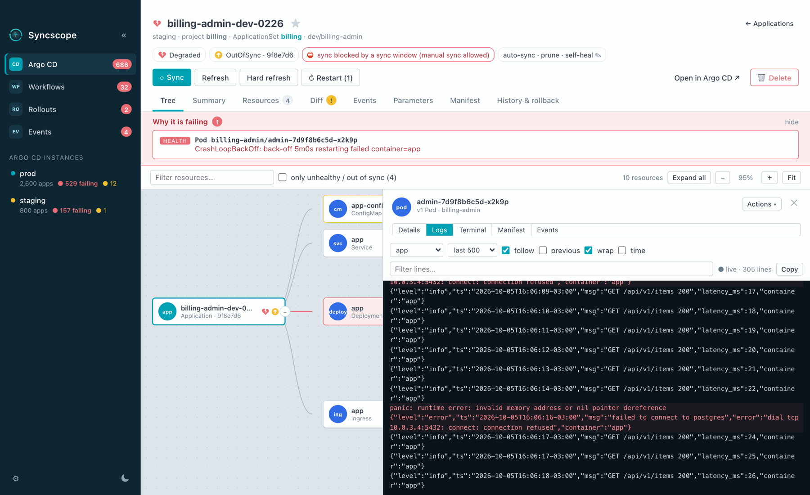

- **Logs**: live logs of a pod (or of all pods of a Deployment, StatefulSet…). Pick the
  container, how many lines, follow, **previous** (the container that crashed), wrap and time.
  Errors are highlighted. If you scroll up, the view stays put and a **↓ Latest (N new)** button
  appears.
- **Terminal**: a shell inside the pod. It needs `exec.enabled: "true"` in `argocd-cm` and the
  `exec, create` RBAC permission; Syncscope tells you if either is missing.
- **Manifest**: the live object in the cluster; **Edit** to change it (Argo CD will report the
  app OutOfSync, and self-heal will undo the change).
- **Diff**: what differs between the cluster and Git for this resource.
- **Events**: Kubernetes events of the resource.
- **Actions ▾**: every action Argo CD offers for this kind (restart, pause, resume…), **Sync only
  this resource** and **Delete resource**.

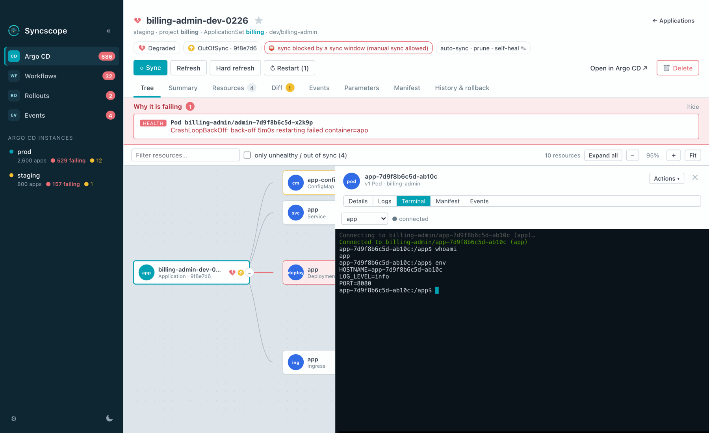

### Diff

Every resource that differs from Git: lines in red are in the cluster, lines in green are in Git.

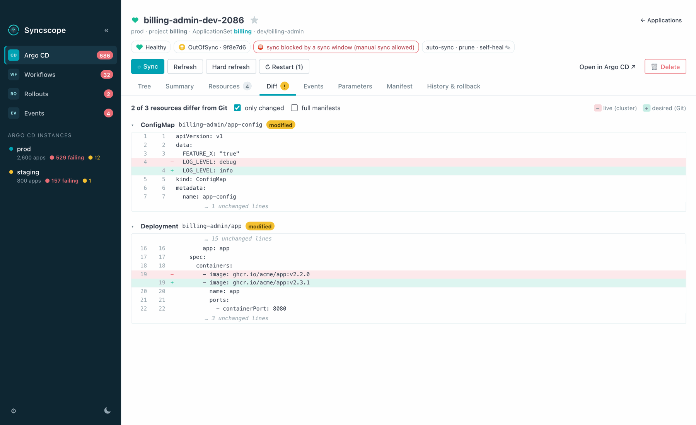

### History & rollback

Every deploy with the commit behind it (message, author, date). **Rollback** returns to a previous
deploy. Argo CD refuses rollbacks while auto-sync is on, and the page tells you so.

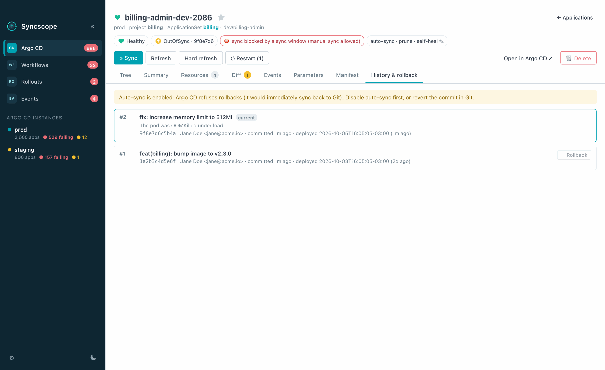

### Parameters

Change Helm values, parameters and value files, Kustomize images, the target revision and the
**Argo CD Image Updater** annotations. Save, then sync the app to apply.

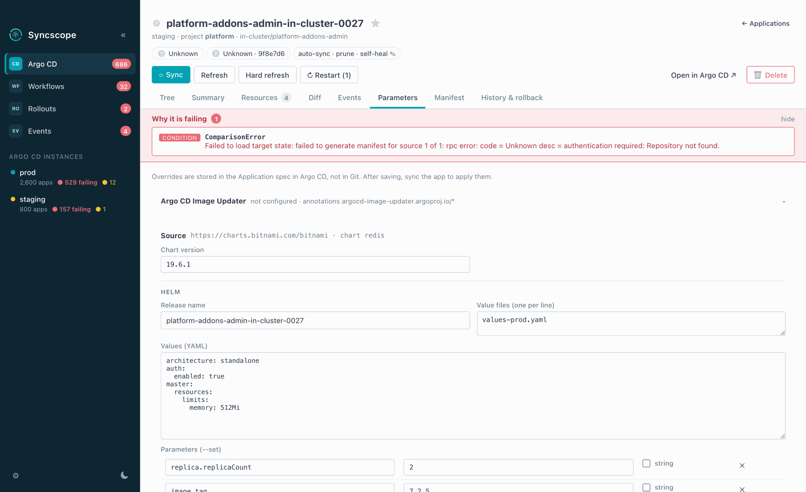

> **ApplicationSet apps:** if an ApplicationSet generated the app, it rewrites the app's spec, so
> manual changes are undone within seconds. Syncscope checks this and shows either "your change
> will stick" or the `ignoreApplicationDifferences` snippet to add to the ApplicationSet.

### Other tabs

- **Summary**: last operation, source and destination, **sync windows**, conditions and deploy
  history.
- **Resources**: the resource list; tick some and **Sync selected** to sync only those.
- **Events**: Kubernetes events of the app.
- **Manifest**: the whole Application as YAML, editable.
- **Sync policy**: click the auto-sync pill in the header to turn auto-sync, prune or self-heal
  on or off.

## 8. Act on many apps at once

Tick apps in the list (Shift-click selects a range; ⌘A selects every app in the current search).
A bar appears with **Sync, Refresh, Hard refresh, Restart, Sync policy…** and **Delete**.

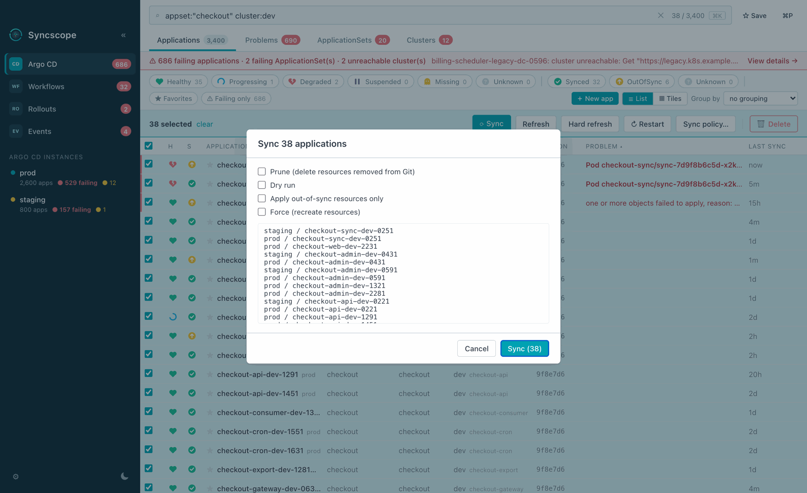

Each action asks for confirmation; deleting asks you to type the app name (or "delete N"). When
it finishes, a notification shows how many apps succeeded and **why each failure failed**.

## 9. Kubernetes clusters

Argo Workflows, Argo Events and Argo Rollouts are read straight from Kubernetes with your
kubeconfig, like Lens does. In **Settings → Kubernetes clusters**, tick the contexts you want.

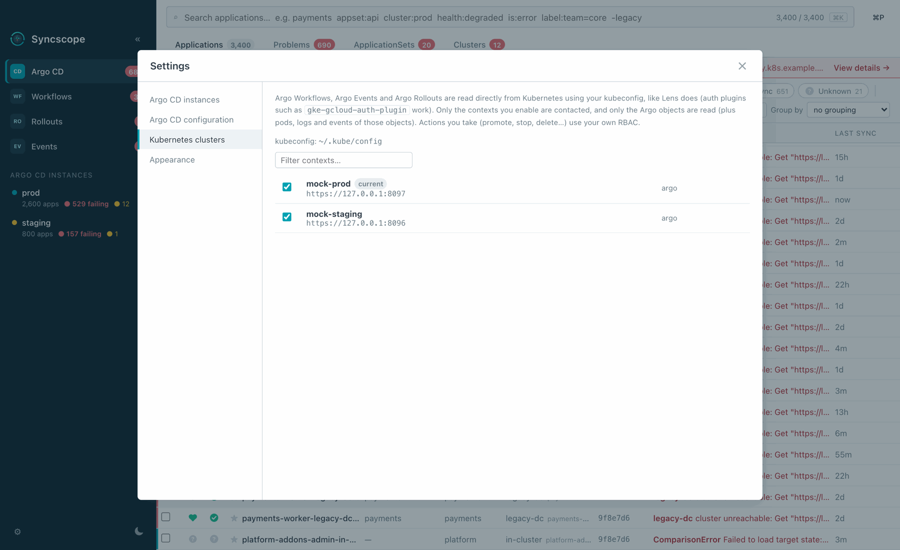

- Nothing is contacted until you tick it.
- Auth plugins such as `gke-gcloud-auth-plugin` work as in `kubectl`.
- Only Argo objects are read, plus the pods, logs and events of those objects.
- Actions (promote, stop, delete…) use your own Kubernetes permissions.

## 10. Argo Workflows

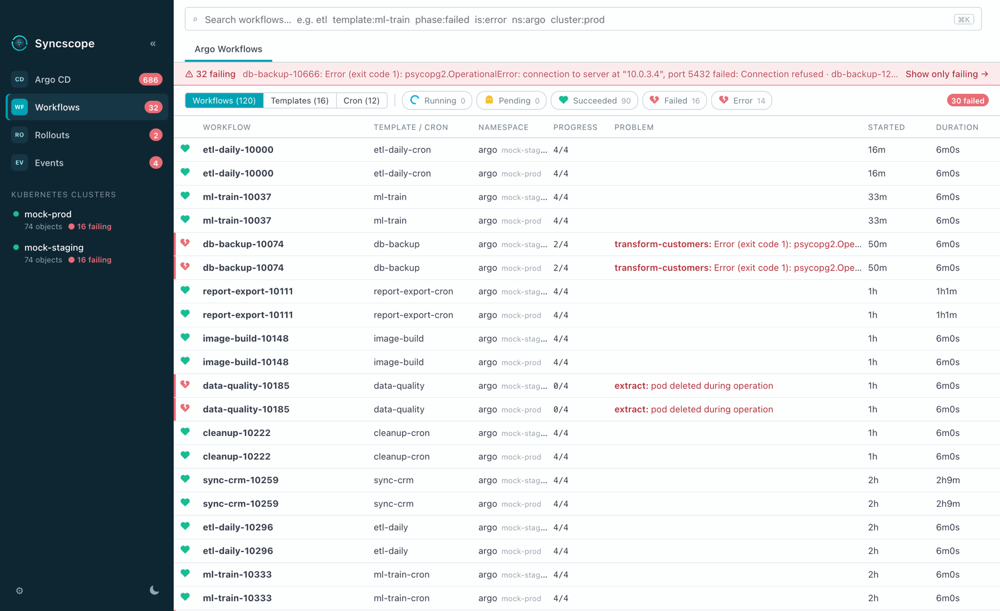

- **Workflows**: every run, newest first, with phase filters (Running, Failed…), the template or
  cron behind it, progress and duration. Failed runs show the failing step and its error.
- **Templates**: WorkflowTemplates. Open one to **submit** a run with your parameters.
- **Cron**: CronWorkflows, with schedule, last run and success/failure counts. **Run now**,
  **Suspend** or **Resume** the schedule.

Open a workflow to see its **graph**. Failed steps are red, and the reason sits at the top.

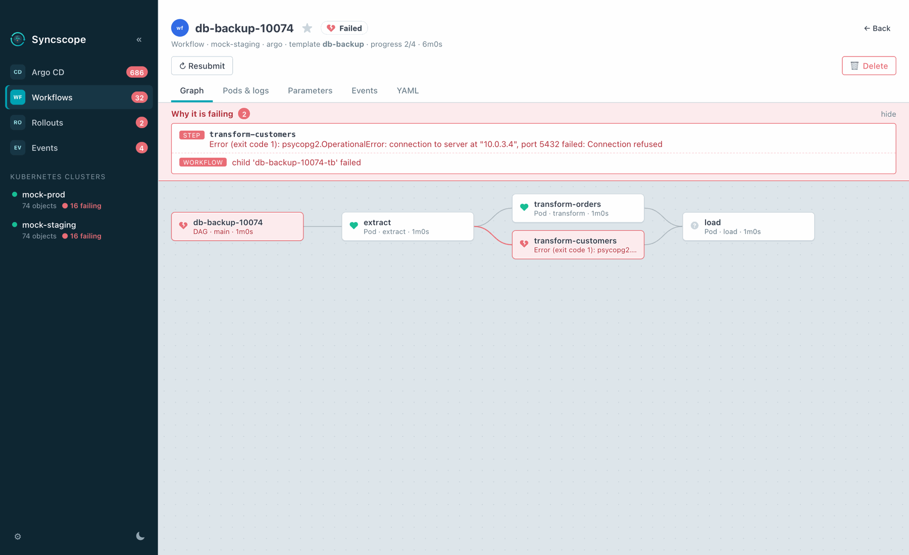

Click a step to see its inputs and outputs and the **logs of its pod** (the `main` container by
default).

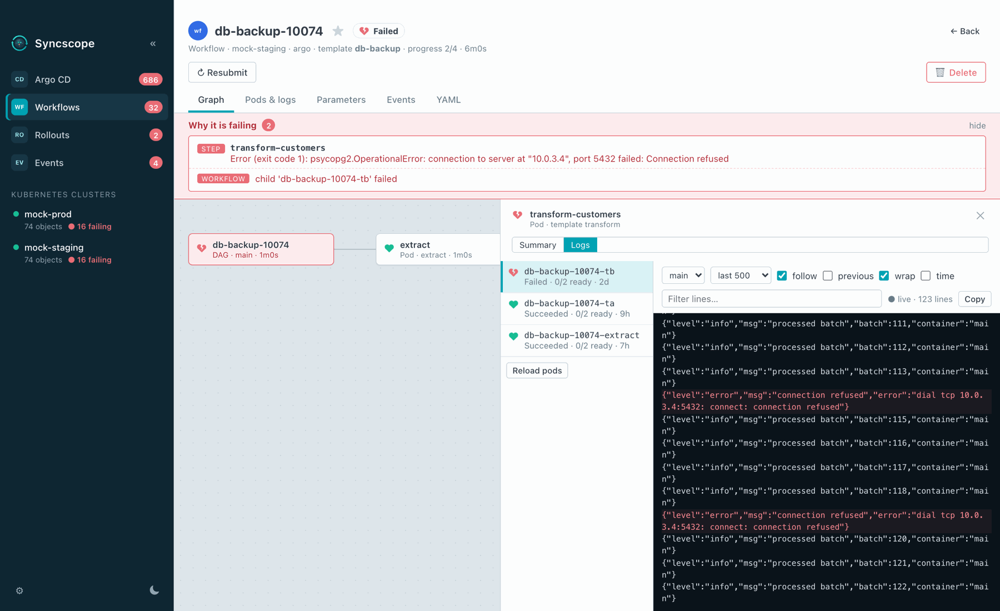

Actions: **Suspend / Resume**, **Stop** (runs exit handlers), **Terminate**, **Resubmit** and
**Delete**.

## 11. Argo Rollouts

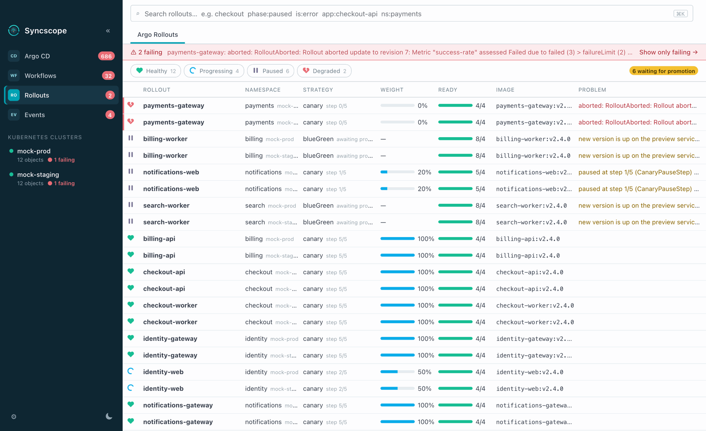

Each rollout shows its strategy (canary or blue/green), the current step, the traffic weight on the
new version, ready replicas and image. Rollouts waiting for you are flagged
**waiting for promotion**.

Open a rollout to see its steps and act on it.

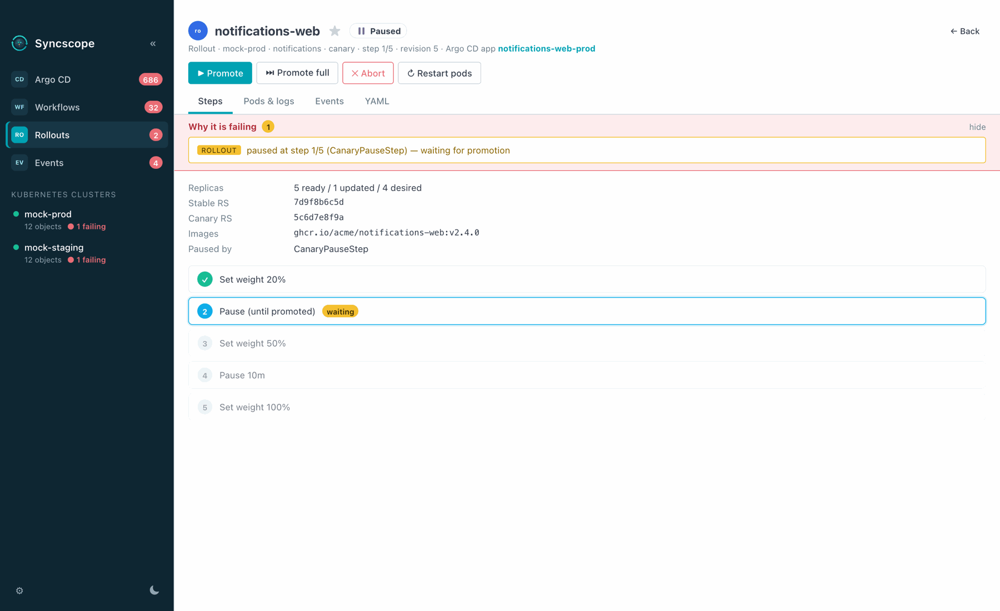

- **Promote**: go to the next step.
- **Promote full**: skip the remaining steps.
- **Pause**, **Abort** (go back to the stable version), **Retry** after an abort, **Restart pods**.
- The link next to *Argo CD app* opens the Argo CD application that deploys the rollout.

## 12. Argo Events

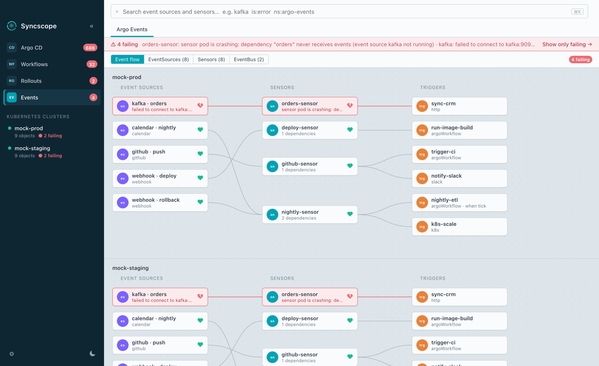

**Event flow** draws, per cluster, how events travel: **event sources → sensors → triggers**.
A broken link is red all the way, so you see at once that, for example, the `kafka` source is down
and therefore the `orders-sensor` never fires `sync-crm`.

The **EventSources**, **Sensors** and **EventBus** tabs list each object with its problems. Open
one for its pods and logs, events and YAML, or **Restart pods**.

## 13. Command palette and shortcuts

**⌘P** opens the palette. Type part of any name (apps, ApplicationSets, workflows, rollouts,
event sources) or a command such as *Go to Rollouts*, *New application…*, *Open settings*.
With nothing typed, it shows your recent items and favorites.

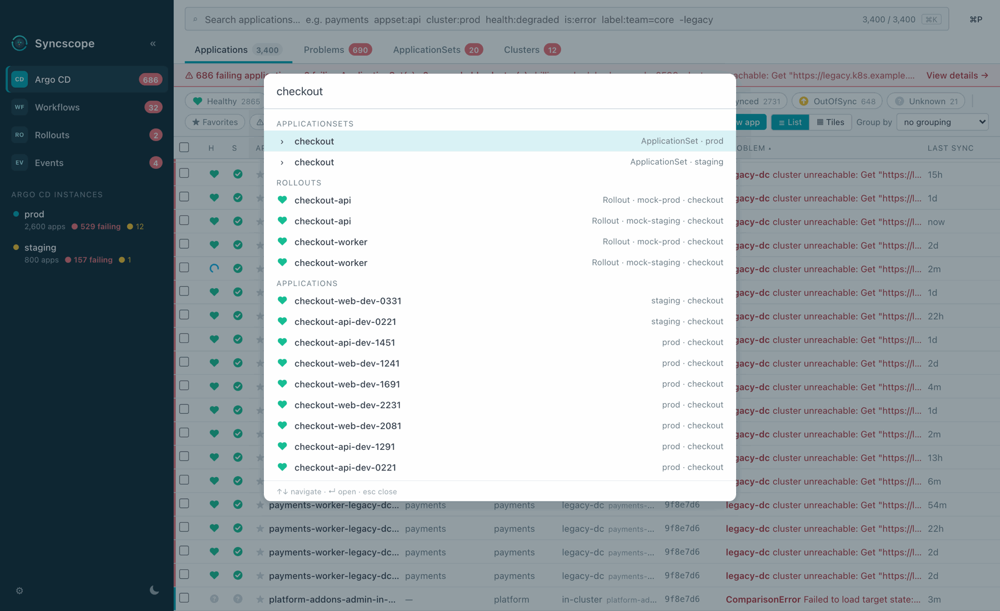

| Shortcut | Action |
|---|---|
| ⌘P | Command palette |
| ⌘K or `/` | Focus the search |
| ⌘B | Show / hide the sidebar |
| ↑ ↓ or j k | Move in the app list |
| Enter | Open the selected app |
| Space | Select / unselect it |
| ⌘A | Select every app in the current search |
| Esc | Close a page or dialog; clear the selection |

## 14. Manage the Argo CD configuration

**Settings → Argo CD configuration** shows, for each instance:

- **Repositories**, with their connection status. **Connect repository** adds one (public, HTTPS
  credentials or SSH key); **Remove** deletes it.
- **Projects**: create, edit (YAML, including sync windows) and delete.
- **Accounts**: generate and revoke API tokens.
- **Clusters**: rename or remove.
- **Settings**: the instance's Argo CD settings, read-only.

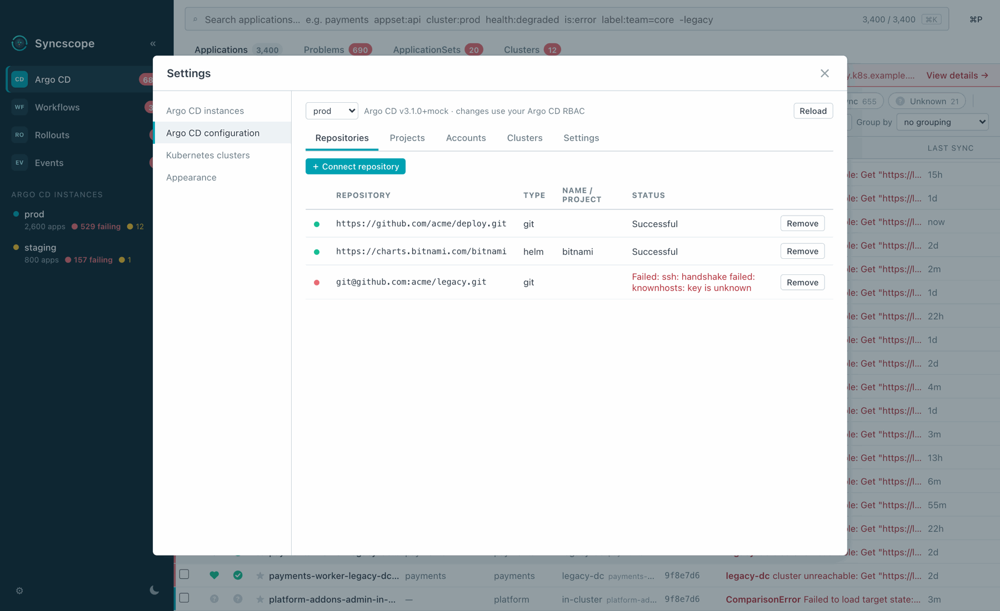

Changes use your Argo CD permissions: if your role cannot do something, Argo CD's error is shown.

To create an application, use **＋ New app** on the Applications tab: you get a ready-to-edit YAML
template, validated by Argo CD when you click **Create**.

## 15. Notifications, cache and updates

- **Desktop notifications** (*Settings → Appearance*): Syncscope tells you when an app, a sync,
  a workflow, a rollout or an event source starts failing, and optionally when it recovers. Events
  within 5 seconds are grouped into one notification; clicking it opens the item.
- **Cache**: the last known state of every instance is saved on disk, so the app opens instantly
  even with thousands of apps, and even when the server is unreachable. A blue banner says when you
  are looking at cached data.
- **Updates**: once a day Syncscope checks for a new release and offers it in a notification
  (*Settings → Appearance* turns this off).

## 16. Troubleshooting

| Symptom | What to do |
|---|---|
| **SSO login fails with "port in use"** | Another login is using port 8085 (often `argocd login --sso`). Close it, or change the callback port in the instance settings. |
| **Instance shows "login required"** | The session expired and could not be renewed. Click **Log in** on the instance. |
| **Terminal says exec is disabled** | Ask your Argo CD admin to set `exec.enabled: "true"` in `argocd-cm` and grant `exec, create`. |
| **My change in Parameters / sync policy disappears** | The app is generated by an ApplicationSet that rewrites it. Change the ApplicationSet (or Git), or add `ignoreApplicationDifferences`; the warning in the page shows the exact YAML. |
| **Workflows / Rollouts / Events are empty** | Enable a cluster in *Settings → Kubernetes clusters*. If it says "not installed", that tool is not in the cluster; "no permission" means your RBAC cannot list it. |
| **Rollback is disabled** | Argo CD refuses rollbacks while auto-sync is on. Turn auto-sync off first, or revert the commit in Git. |
| **macOS says the app is damaged or from an unknown developer** | Right-click → **Open**, or allow it in *System Settings → Privacy & Security*. |
| **Where are my settings?** | `~/Library/Application Support/syncscope/` on macOS (the config dir on Linux and Windows). Tokens are in the system keychain. |

---

## Regenerating the screenshots

For contributors: the images in `docs/images` are generated by `scripts/screenshots/shoot.mjs`
against the mock servers, so they can be refreshed whenever the UI changes.

```bash
# 1. demo data: two fake Argo CD instances and two fake clusters
go run ./cmd/mockargo -port 8099 -apps 2600 -name prod &
go run ./cmd/mockargo -port 8098 -apps 800 -name staging &
go run ./cmd/mockkube -port 8097 -name prod -kubeconfig /tmp/demo.kubeconfig &
go run ./cmd/mockkube -port 8096 -name staging -kubeconfig /tmp/demo.kubeconfig &

# 2. the app with an isolated config (two instances + both clusters enabled)
mkdir -p /tmp/demo-config && cat > /tmp/demo-config/config.json <<'EOF'
{"contexts":[{"id":"prod01","name":"prod","server":"http://localhost:8099","authType":"sso"},
             {"id":"stg01","name":"staging","server":"http://localhost:8098","authType":"password"}],
 "prefs":{"kubeContexts":["mock-prod","mock-staging"]}}
EOF
SYNCSCOPE_KUBECONFIG=/tmp/demo.kubeconfig SYNCSCOPE_CONFIG_DIR=/tmp/demo-config SYNCSCOPE_NO_KEYRING=1 wails dev &

# 3. shoot (any Chromium-based browser; puppeteer-core is the only dependency)
npm install --prefix /tmp/shots puppeteer-core
cp scripts/screenshots/shoot.mjs /tmp/shots/ && OUT=$PWD/docs/images \
  CHROME="/Applications/Google Chrome.app/Contents/MacOS/Google Chrome" node /tmp/shots/shoot.mjs

# 4. shrink them for the repo (256-colour PNGs keep text sharp at ~90 KB each)
python3 -c "import glob; from PIL import Image
for p in glob.glob('docs/images/*.png'):
    im = Image.open(p).convert('RGB'); im.thumbnail((1800, 1800))
    im.quantize(256, method=Image.Quantize.FASTOCTREE, dither=Image.Dither.NONE).save(p, optimize=True)"
```
